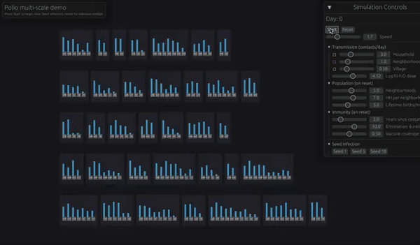

# bevy-multiscale

Bevy-based multiscale polio transmission simulation demo.

Visualizes disease transmission dynamics across a hierarchical population structure (individuals → households → neighborhoods → village) at three interactive scales.



## Running

```bash
cargo run
```

## Views

A landing page lets you choose between three views:

- **Individual** — Single-person immune response. Edit age & sex, challenge with WPV or OPV, and watch immunity and shedding on a time-series chart.
- **Neighborhood** — Household transmission grid (5 neighborhoods × 7 households). Seed infections, run OPV campaigns, and watch transmission arcs spread. Daily infection chart tracks WPV/VDPV/OPV counts.
- **Region** — 2000-bari spatial landscape loaded from CSV. Zoom & pan, seed infections, run OPV campaigns with VDPV emergence tracking, and monitor the daily infection time-series.

## Controls

- **Start/Pause/Reset**: Simulation controls (reset preserves current parameters)
- **Seed 1/5/10**: Introduce WPV infections
- **OPV 20%/50%/80%**: Vaccinate under-5s (neighborhood & region views)
- **Speed slider**: Adjust simulation speed (0.5x–30x)
- **Mouse wheel**: Zoom; **middle-click drag** or **left-click drag**: Pan

Hover over individuals for tooltips showing age, immunity, and infection status.

## Features

- Hierarchical population with realistic age-structured household composition
- Three-level transmission (household, neighborhood, village)
- Immunity initialization based on cessation timing and vaccine coverage
- Fill color shows immunity (brown → beige → green); border color shows shedding by strain (WPV=red, VDPV=orange, OPV=cyan)
- Transmission arcs showing infection spread
- OPV → VDPV reversion tracking

## Related

Disease model and parameters adapted from [pybevy-polio](https://github.com/edwenger/pybevy-polio).

## Dependencies

- Bevy 0.13
- bevy_egui 0.25
