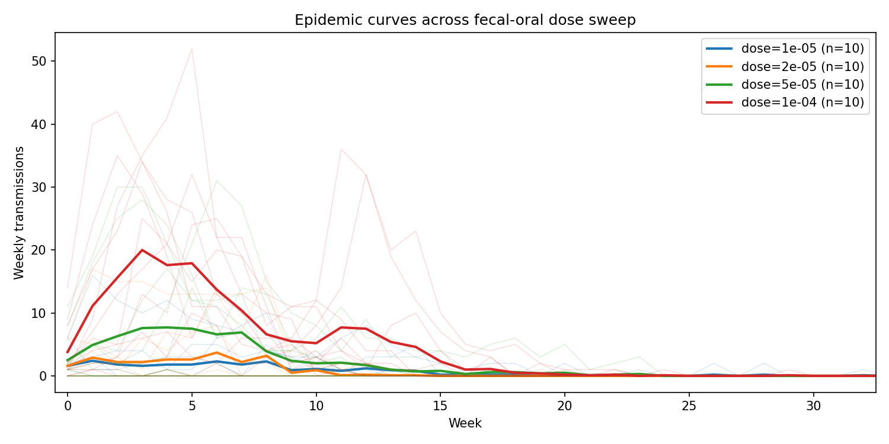
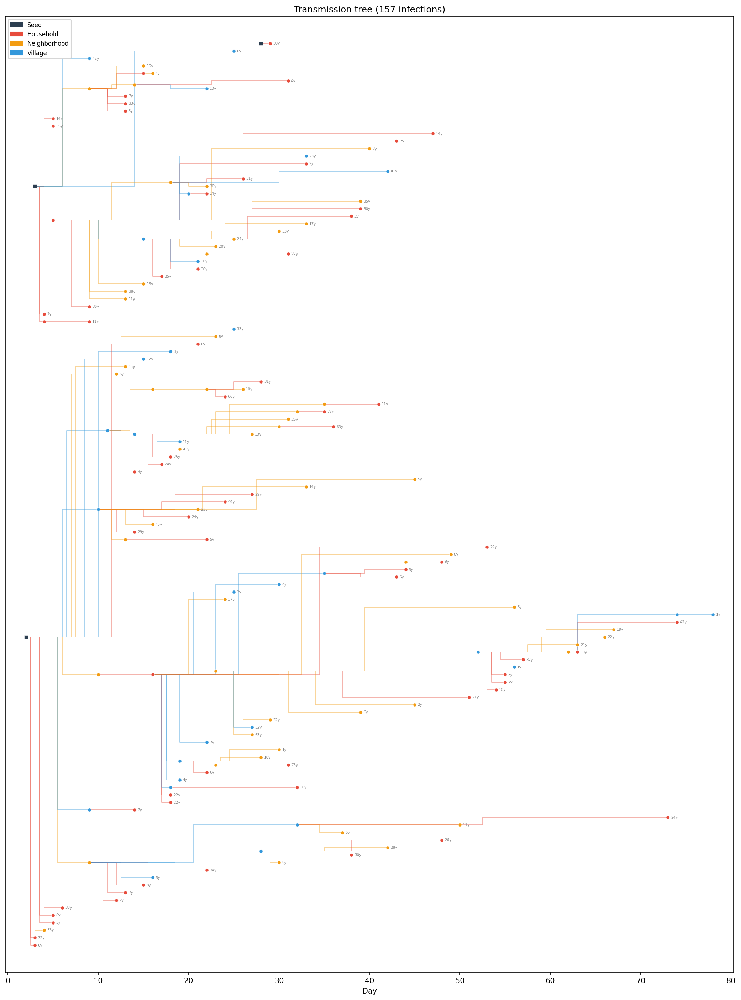

# Analysis Scripts

Python scripts for batch simulation and visualization of headless transmission outputs.

## Prerequisites

```bash
pip install pandas numpy matplotlib pyyaml
```

## Scripts

### `sweep.py` — Parameter sweep

Runs the `headless` binary across all combinations of random seeds and fecal-oral dose values, then plots weekly epidemic curves with faint individual traces and bold seed-averaged lines.

```bash
python scripts/sweep.py
```

Sweep parameters (configured at top of script):
- 10 random seeds (0–9)
- 4 fecal-oral doses: 1e-5, 2e-5, 5e-5, 1e-4
- 40 total simulations

Outputs to `output/` — one CSV per run plus `sweep_results.png`.



### `transmission_tree.py` — Transmission tree

Visualizes the infection chain from a single simulation CSV as a branching tree:
- **x-axis** = day of infection
- **y-axis** = tree layout (children spread vertically from their parent)
- **Edges** colored by contact level: household (red), neighborhood (orange), village (blue)
- **Seed cases** shown as black squares; leaf nodes labeled with age

```bash
python scripts/transmission_tree.py output/seed2_dose5e-05.csv
```

Handles re-infections correctly by treating each transmission event as a unique node.


